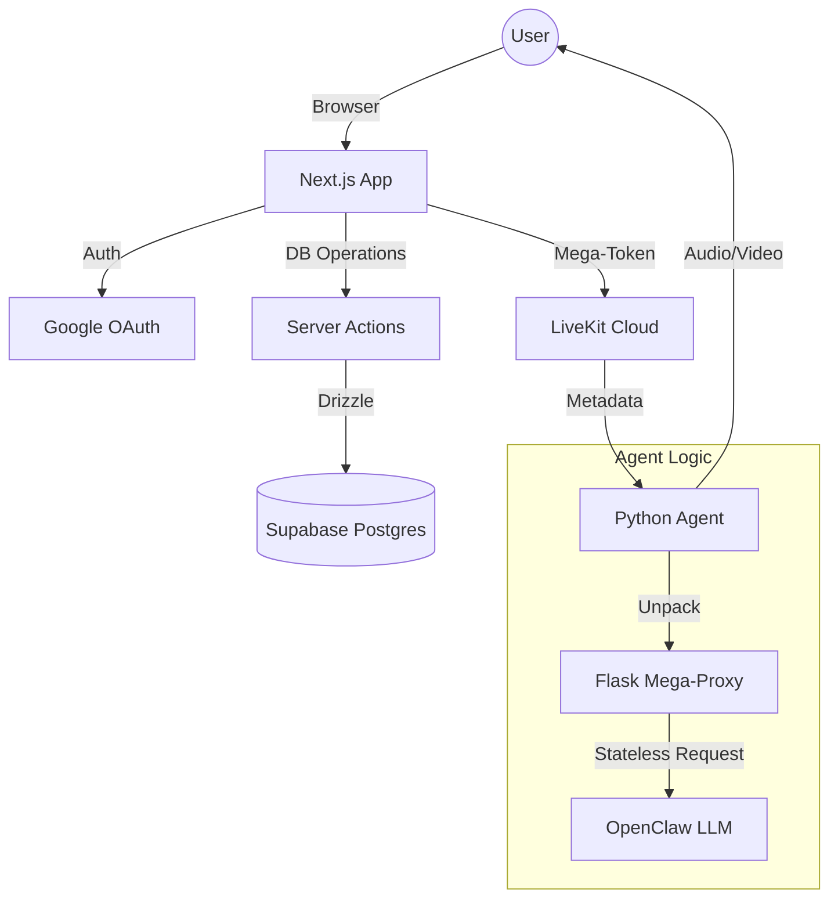

# ClawdFace: Production-Grade Video AI Platform

ClawdFace is a high-performance, real-time Video AI platform built with Next.js and LiveKit. It features a robust **Hybrid Architecture with Drizzle ORM**, combining real-time scalability with persistent database management on Supabase.

---

## 🚀 Key Features

- **Drizzle ORM Persistence**: Type-safe database management for user profiles, bots, and conversation history.
- **Dynamic Voice Selection**: Automatically switches ElevenLabs voice IDs based on avatar gender (Male/Female).
- **Client-Server Separation**: Uses Next.js Server Actions to protect database credentials and resolve environment-specific build issues.
- **Production AI Stack**: Integrated with Deepgram (STT), OpenAI (LLM), ElevenLabs (TTS), and Trugen (Avatar).
- **OpenClaw Integration**: First-class support for OpenClaw custom LLM providers with session persistence.
- **Google Auth**: Secure, verified access using Google OAuth.
- **Premium UI**: Built with Framer Motion for smooth, glassmorphic interactions and real-time audio visualization.

---

## 🛠️ Technology Stack

| Layer | Technology |
| :--- | :--- |
| **Frontend** | Next.js 15+, React 18, TailwindCSS, Framer Motion |
| **Real-time** | LiveKit Cloud / @livekit/components-react |
| **Google Auth**| @react-oauth/google (Implicit Flow + Profile Sync) |
| **AI Agent** | Python 3.12+, livekit-agents framework |
| **Persistence** | Drizzle ORM + Supabase (Shared Pooler) |
| **Verification** | Environment Variables (`VERIFIED_EMAILS`) |
| **STT / TTS** | Deepgram Nova-2 / ElevenLabs Flash v2.5 |
| **Avatar** | Trugen AI |

---

## 🏗️ Architecture Overview

ClawdFace utilizes a **"Bridge"** pattern to connect decentralized configurations to stateless agents.



---

## 📦 Project Structure

```text
.
├── agent.py            # The Stateless Python Agent (Stateless / Mega-Token logic)
├── frontend/           # Next.js Application
│   ├── app/            # App Router & API Endpoints
│   ├── components/     # UI Components (Sidebar, visualizers, etc.)
│   └── lib/            # Shared logic (Auth, User Store)
├── data/               # Local data persistence for development
│   ├── user-configs/   # JSON archive of user settings
│   └── verified-users.json
├── pyproject.toml      # Backend dependencies
└── package.json        # Frontend dependencies
```

---

## ⚙️ Configuration & Environment

### Frontend (.env.local)
```env
NEXT_PUBLIC_LIVEKIT_URL=wss://...
LIVEKIT_API_KEY=...
LIVEKIT_API_SECRET=...
NEXT_PUBLIC_GOOGLE_CLIENT_ID=...
NEXT_PUBLIC_SUPABASE_URL=...
NEXT_PUBLIC_SUPABASE_ANON_KEY=...
DATABASE_URL=postgresql://...
TRUGEN_API_KEY=...
VERIFIED_EMAILS=yourname@gmail.com,other@domain.com
```

### Backend (.env)
```env
LIVEKIT_URL=...
LIVEKIT_API_KEY=...
LIVEKIT_API_SECRET=...
DEEPGRAM_API_KEY=...
ELEVEN_API_KEY=...
OPENAI_API_KEY=...
TRUGEN_API_KEY=...
```

---

## 🛠️ Getting Started

### 1. Requirements
- Node.js 20+
- Python 3.10+
- LiveKit Cloud Account

### 2. Setup
```bash
# Clone the repository
git clone https://github.com/Bharath8080/clawdface_v1.git
cd clawdface_v1

# Install Frontend
cd frontend
npm install

# Install Backend
cd ..
uv sync
```

### 3. Running Locally
1. Start the Frontend: `cd frontend && npm run dev`
2. Start the Agent: `python agent.py dev`


---

## 📜 License
MIT License - Copyright (c) 2026.
